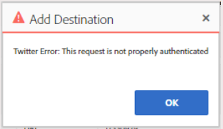

# AAM, Twitter ID-Synchronisierung und/oder Ziel Gibt Authentifizierungsfehler zurück

Erfahren Sie, wie Sie den Adobe Audience Manager-Authentifizierungsfehler beim Konfigurieren einer Twitter ID-Synchronisierung und/oder eines Ziels in AAM beheben können.

## Beschreibung {#description}

<b>Umgebung</b>
Adobe Audience Manager

<b>Problem</b>
Beim Konfigurieren einer Twitter ID-Synchronisierung und/oder eines Ziels in AAM erhalten Benutzer diesen Authentifizierungsfehler:

## Auflösung {#resolution}

<b>Lösung</b>

Segmente mit (`+` `&` `,` `%` `:` `;` `@` `/` `=` `?` `$`), kann aufgrund von Einschränkungen in der Twitter-API nicht einem Twitter-Ziel zugeordnet werden.

Achten Sie beim Erstellen des Twitter-Ziels (oder beim Zuordnen neuer Segmente zu einem vorhandenen Twitter-Ziel) darauf, nur Segmente auszuwählen, die diese Zeichen nicht enthalten.

Wenn ein Segment an Twitter gesendet werden muss und diese Zeichen im Titel enthalten sind, ändern Sie den Segmentnamen, bevor Sie die Zuordnung zu Twitter vornehmen.

[Klicken Sie hier für weitere Details.](https://experienceleague.adobe.com/docs/audience-manager/user-guide/features/destinations/device-based/twitter-tailored-audiences.html?lang=en#segment-mapping-considerations) in unserem Adobe Audience Manager-Handbuch in Adobe Experience League.
