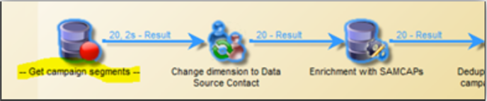

# Best Practices bei Workflows - Konfiguration und Überwachung in Campaign Classic

In diesem Artikel werden einige Best Practices für die Konfiguration und Überwachung von Workflows in Adobe Campaign Classic erläutert.

## Beschreibung {#description}

### <b>Umgebung</b>

- Adobe Campaign
- Adobe Campaign Classic

### <b>Problem</b>

In den meisten Fällen bilden Workflows einen Teil der Kernfunktionen der Plattform (integriert oder benutzerdefiniert). Daher ist es sehr wichtig, bei der Konfiguration dieser Parameter sorgfältig vorzugehen.

## Auflösung {#resolution}

### Allgemeine Konfiguration

#### Organisation

Erstellen Sie Ihre Workflows, z. B. den Import in tableXXX, in einem benutzerdefinierten Ordner.

Nur wenn der allgemeine Workflow die gesamte Plattform betrifft (z. B. Bereinigung), können Sie erwägen, ihn in der integrierten <b>Technische Workflows</b> Ordner.

#### Workflow-Name

Wie bereits erläutert, ist es sehr wichtig, Workflows mit eigenen Namen und Bezeichnungen zu versehen. Da ein Benutzer nicht immer auf die Dokumentation verweist, füllen Sie die <b>description</b> -Feld, um den auszuführenden Prozess zusammenzufassen.

Wenn der Workflow Teil eines Prozesses ist, der mehrere Workflows umfasst, sollten Sie bei der Eingabe eines Titels explizit sein. Die Verwendung von Zahlen ist eine gute Möglichkeit, die Workflows (nach Titel) zu ordnen. Beispiel:

- 001 - Import - Empfänger importieren
- 002 - Import - Verkäufe importieren
- 003 - Importieren - Verkaufsdetails importieren
- 010 - Exportieren - Versandlogs exportieren
- 011 - Export - Trackinglogs exportieren

#### Schweregrad

Konfigurieren Sie die Prioritätsstufe eines Workflows in den Workflow-Eigenschaften im Abschnitt <b>Ausführung</b> tab:

- Normal
- Produktion
- Kritisch

Die Angabe dieser Informationen bei der Erstellung eines Workflows hilft dabei, den Schweregrad des konfigurierten Prozesses zu verstehen.

#### Protokolle

Die JavaScript-Methode `logInfo()` ist eine großartige Lösung zum Debuggen eines Workflows. Dies ist nützlich, muss aber mit Vorsicht verwendet werden, insbesondere für häufig ausgeführte Aktivitäten: Es kann die Protokolle überlasten und die Größe der Log-Tabelle erheblich vergrößern.

Aber vielleicht brauchen Sie auch mehr als `logInfo()`. Zwei weitere Lösungen stehen zur Verfügung.

<b>Zwischen zwei Ausführungen die ermittelte Population beibehalten</b>

Diese Option ist in den Workflow-Eigenschaften verfügbar. <b>Allgemein</b> -Registerkarte, kann so nützlich sein, wie es gefährlich sein kann. Dadurch wird verhindert, dass Adobe Campaign die zwischen zwei Ausführungen erstellten temporären Tabellen löscht. Dies kann zwar für Entwicklungsumgebungen nützlich sein, ist jedoch nicht erlaubt, es in Produktionsumgebungen zu verwenden und sollte überwacht werden. Die Beibehaltung temporärer Tabellen könnte dazu führen, dass die Größe der Datenbank erheblich zunimmt und schließlich die Größenbeschränkung erreicht wird. Außerdem wird das Backup verlangsamt.

<b>Keine Workflows</b> Diese Option sollte bei der Produktion jederzeit aktiviert sein.

<b><u>SQL-Abfragen im Protokoll speichern</u>:</b>

Verfügbar im <b>Ausführung</b> in den Workflow-Eigenschaften werden alle SQL-Abfragen protokolliert, die vom Tool aus den verschiedenen Aktivitäten generiert wurden. Es ist eine großartige Möglichkeit zu sehen, was von der Plattform tatsächlich ausgeführt wird. Diese Option sollte jedoch nur vorübergehend während der Entwicklung verwendet und nicht in der Produktion aktiviert werden.

#### Überwachung

Alle Ihre geplanten Workflows, die in Produktionsumgebungen ausgeführt werden, sollten überwacht werden, damit sie bei Auftreten eines Fehlers benachrichtigt werden.

Wählen Sie in den Workflow-Eigenschaften eine <b>Supervisor-Gruppe</b>, entweder die standardmäßigen &quot;Workflow-Supervisoren&quot;oder eine benutzerdefinierte Gruppe. Stellen Sie sicher, dass mindestens ein Benutzer dieser Gruppe angehört und eine E-Mail eingerichtet ist.

<b><u>Workflows nicht pausiert lassen</u>:</b>

Wenn Sie einen temporären Workflow erstellen, stellen Sie sicher, dass dieser ordnungsgemäß beendet werden kann und nicht im Status &quot;ausgesetzt&quot;verbleibt. Wenn sie angehalten wird, würde dies bedeuten, dass Sie die temporären Tabellen beibehalten und somit die Größe der Datenbank erhöhen müssen.

### Innerhalb des Workflows

#### Aktivitätsname

Bei der Entwicklung Ihres Workflows haben alle Aktivitäten einen Namen, ebenso wie alle Adobe Campaign-Objekte. Während der Name vom Tool generiert wird, sollten Sie ihn bei der Konfiguration mit einem expliziten Namen umbenennen. Das Risiko besteht darin, dass der Workflow mit Aktivitäten, die den Namen einer anderen vorherigen Aktivität verwenden, unterbrochen wird. Es wäre also schwierig, die Namen nachträglich zu aktualisieren.

Der Aktivitätsname finden Sie im Abschnitt <b>Erweitert</b> Registerkarte. Lassen Sie sie nicht abfragen, query1, query11, sondern geben Sie ihnen explizite Namen wie `querySubscribedRecipients`. Dieser Name wird im Protokoll und gegebenenfalls in den SQL-Protokollen angezeigt. Dies hilft beim Debugging des Workflows bei der Konfiguration.

#### JavaScript in einer Aktivität

Sie können bei der Initialisierung einer Workflow-Aktivität JavaScript hinzufügen. Dies kann in der Aktivität <b>Erweitert</b> Registerkarte. Um die Erkennung des Workflows zu vereinfachen, wird wie folgt empfohlen, am Anfang und Ende des Titels der Aktivität doppelte Bindestriche zu verwenden: *— Mein Titel —*

#### Signal

Meistens wissen Sie nicht, woher das Signal stammt. Um dieses Problem zu vermeiden, verwenden Sie die <b>Kommentar</b> -Feld innerhalb der <b>Erweitert</b> -Tab der Signalaktivität, um den erwarteten Ursprung eines Signals für diese Aktivität zu dokumentieren.

#### Workflow-Update

Ein Produktions-Workflow sollte nicht direkt aktualisiert werden. Wenn der Prozess nicht darin besteht, eine Kampagne mit Vorlagen-Workflows zu erstellen, sollten Prozesse nach Möglichkeit zuerst in einer Entwicklungsumgebung getestet werden. Erst nach dieser Validierung kann der Workflow bereitgestellt und in der Produktion gestartet werden.

Archivierte Workflows können auf Entwicklungs- oder Testplattformen in einer <b>Archiviert</b> -Ordner, aber die Produktion sollte so sauber wie möglich bleiben. Alte Workflows sollten bei Inaktivität aus der Produktion entfernt werden.
