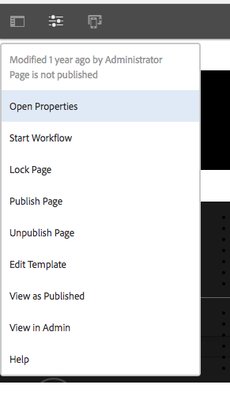

# Dispatcher-Vanity-URLs


In diesem Dokument erfahren Sie, wie AEM mit Vanity-URLs umgeht und einige zusätzliche Techniken, wie die Verwendung von Umschreibungsregeln, um Inhalte näher am Versandrand zuzuordnen.

## Beschreibung {#description}


### Umgebung

Experience Manager

### Probleme/Symptome

Wie geht AEM mit Vanity-URLs um? Gibt es zusätzliche Techniken, um Inhalte näher am Versandrand zuzuordnen?

#### Was sind Vanity-URLs?

Wenn Sie Inhalte haben, die in einer sinnvollen Ordnerstruktur gespeichert sind, sind sie nicht immer unter einer URL zu finden, die leicht zu referenzieren ist. Vanity-URLs sind wie Abkürzungen. Kürzere oder eindeutige URLs, die auf den tatsächlichen Inhalt verweisen.

Beispiel: <b>*/aboutus</b> mit <b>/content/we-retail/us/en/about-us.html</b>*

AEM-Autorinnen und -Autoren haben die Möglichkeit, Eigenschaften von Vanity-URLs für Inhalte in AEM festzulegen und zu veröffentlichen.

Damit diese Funktion funktioniert, müssen Sie die Dispatcher-Filter anpassen, damit die Vanity durchlaufen wird. Dies ist mit der Anpassung der Dispatcher-Konfigurationsdateien in der Geschwindigkeit nicht sinnvoll, die Autoren zum Einrichten dieser Vanity-Seiteneinträge benötigen würden.

Aus diesem Grund verfügt das Dispatcher-Modul über eine Funktion, mit der automatisch alles zugelassen wird, was in der Inhaltsstruktur als Vanity aufgeführt ist.


## Auflösung {#resolution}


### Funktionsweise

#### Verfassen von Vanity-URLs

Der Autor besucht eine Seite in AEM, besucht die Seiteneigenschaften und fügt die Einträge in den Vanity-URL-Abschnitt ein.

Nachdem sie ihre Änderungen gespeichert und die Seite aktiviert haben, wird dieser Seite nun die Vanity zugewiesen.

<b><u>Touch-Benutzeroberfläche</u>:</b>




<b><u>Classic Content Finder</u>:</b>


<b>Hinweis:</b> Bitte verstehen Sie, dass dies sehr anfällig für Namensraumprobleme ist. Vanity-Einträge sind global für alle Seiten, dies ist nur einer der Mängel, für die Sie Umgehungen planen müssen. Wir werden einige davon später erläutern.

<b><u>Resource Resolving/Mapping</u>:</b>

Jeder Vanity-Eintrag ist ein Sling Map-Eintrag für eine interne Umleitung. Diese Maps sind in der Felix-AEM-Konsole (`/system/console/jcrresolver`)

Im Folgenden finden Sie einen Screenshot des Map-Eintrags, der von einem Vanity-Eintrag erstellt wurde:


Wenn wir im obigen Beispiel die AEM-Instanz auffordern, `/aboutus` zu besuchen, wird sie nach `/content/we-retail/us/en/about-us.html` aufgelöst.

<b><u>Filter mit automatischer Dispatcher-Genehmigung</u>:</b>

Der Dispatcher filtert in einem sicheren Status Anforderungen im Pfad / über den Dispatcher heraus, da dies der Stamm der JCR-Struktur ist.

Es ist wichtig sicherzustellen, dass Herausgeber nur Inhalte von der `/content` und andere sichere Pfade usw... und nicht Pfade wie `/system` usw.

Hier sind die Rumpf-, Vanity-URLs im Basisordner von /. Wie können wir also zulassen, dass sie die Herausgeber erreichen, während sie sicher bleiben?

Der einfache Dispatcher verfügt über einen automatischen Filterallow-Mechanismus. Sie müssen ein AEM-Paket installieren und dann den Dispatcher so konfigurieren, dass er auf diese Paketseite verweist. Besuch [here](https://experience.adobe.com/#/downloads/content/software-distribution/en/aem.html?package=/content/software-distribution/en/details.html/content/dam/aem/public/adobe/packages/granite/vanityurls-components) für das AEM Paket.

Der Dispatcher hat einen Konfigurationsabschnitt in seiner Farm-Datei:


```
/vanity_urls {      /url    "/libs/granite/dispatcher/content/vanityUrls.html"
  /file   "/tmp/vanity_urls"      /delay  300 }
```


Diese Konfiguration weist den Dispatcher an, diese URL von der AEM Instanz abzurufen, die er alle 300 Sekunden anzeigt, um die Liste der Elemente abzurufen, die wir durchsetzen möchten.

Es speichert den Cache der Antwort im /file-Argument, sodass in diesem Beispiel /tmp/vanity_urls

Wenn Sie also die AEM-Instanz unter dem URI besuchen, sehen Sie, was sie abruft:


Es ist eine supereinfache Liste.

#### Neuschreiben der Regeln als Vanity-Regeln

Warum sollten wir die Verwendung von Neuschreibungsregeln anstelle des Standardmechanismus erwähnen, der wie oben beschrieben, in AEM integriert wurde?

Einfach erklärt, Namensraum-Probleme, Leistung und Logik auf höherer Ebene, die besser gehandhabt werden kann.

Sehen wir uns ein Beispiel für den Vanity-Eintrag an `/aboutus` auf ihren Inhalt `/content/we-retail/us/en/about-us.html` mit den `mod_rewrite` -Modul, um dies zu erreichen.

`RewriteRule /aboutus /content/we-retail/us/en/about-us.html PT,L,NC`

Diese Regel sucht nach der Vanity `/aboutus` und holt den vollständigen Pfad vom Renderer mit dem PT-Flag (Pass Through).

Es wird auch die Verarbeitung aller anderen Regeln L Flag (Letzte) stoppen, was bedeutet, dass es nicht auf einer riesigen Liste von Regeln wie JCR Resolving zu durchlaufen hat.

Diese beiden Elemente dieser Methode erfordern nicht nur die Proxy-Anforderung, sondern auch die Wartezeit, bis der AEM-Publisher auf diese beiden Elemente reagiert.

Das Tüpfelchen auf dem i ist das NC-Flag (No Case-Sensitive), d. h. wenn eine Kundin bzw. ein Kunde die URI mit `/Aboutus` statt `/aboutus` eingibt, funktioniert sie trotzdem und ermöglicht den Abruf der richtigen Seite.

Um eine entsprechende Neuschreibungsregel zu erstellen, erstellen Sie eine Konfigurationsdatei auf dem Dispatcher (Beispiel: `/etc/httpd/conf.d/rewrites/examplevanity_rewrite.rules`) und fügen sie in die `.vhost`-Datei ein, die die Domain behandelt, für die diese Vanity-Urls gelten sollen.

Im Folgenden finden Sie ein Beispiel für einen Code-Snippet der Include-Komponente:


```
/etc/httpd/conf.d/enabled_vhosts/we-retail.vhost
 VirtualHost *:80    ServerName    weretail.com    ServerAlias 

www.weretail.com        ........ SNIP ........     IfModule mod_rewrite.c   

   ReWriteEngine    on       LogLevel warn rewrite:info

Include /etc/httpd/conf.d/rewrites/examplevanity_rewrite.rules      / IfModule         
   ........ SNIP ......../VirtualHost
```


### Welche Methode und wo soll sie angewendet werden?

A. Die Verwendung von AEM zur Steuerung von Vanity-Einträgen bietet folgende Vorteile:

- Autorinnen und Autoren können sie im Handumdrehen erstellen
- Sie sind direkt mit dem Inhalt verknüpft und können zusammen mit dem Inhalt verpackt werden


B. Verwendung `mod_rewrite` zur Steuerung von Vanity-Einträgen hat die folgenden Vorteile:

- Schnellere Auflösung von Inhalten
- Näher am Rande der Inhaltsanfragen der Endbenutzenden
- Größere Erweiterbarkeit und Optionen zur Steuerung, wie Inhalte unter anderen Bedingungen zugeordnet werden
- Kann Groß- und Kleinschreibung ignorieren


C. Verwenden Sie beide Methoden, aber hier finden Sie die Ratschläge und Kriterien, die Sie verwenden sollten, wenn:

- Wenn die Vanity nur vorübergehend ist und ein geringer Traffic geplant ist, verwenden Sie die in AEM integrierte Funktion
- Wenn die Vanity ein Hefter-Endpunkt ist, der sich nicht häufig ändert und häufig verwendet wird, verwenden Sie eine `mod_rewrite` Regel.
- Wenn der Vanity-Namespace (z. B. `/aboutus`) für viele Marken auf derselben AEM-Instanz wiederverwendet werden muss, verwenden Sie Neuschreibungsregeln


<b>Hinweis:</b> Wenn Sie die AEM Vanity-Funktion verwenden und Namespace vermeiden möchten, können Sie eine Namenskonvention vornehmen. Verwenden von Vanity-URLs, die wie `/brand1/aboutus, brand2/aboutus, brand3/aboutus`
