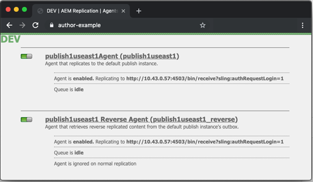

# Adobe Managed Services Dispatcher Flushing

Erkunden Sie die Nuancen der Cache-Flushing-Mechanismen und der Workflows zur Aktivierung von Inhalten, die für die Aufrechterhaltung der Systemeffizienz und Datenintegrität unerlässlich sind.

## Beschreibung {#description}

### <b>Umgebung</b>

Experience Manager

### <b>Problem/Symptome</b>

In diesem Dokument wird erläutert, wie das Leeren erfolgt, und der Mechanismus erläutert, der das Leeren und Invalidieren des Cache ausführt.
  Funktionsweise 
<b>Reihenfolge der Vorgänge</b>

Der typische Workflow wird am besten beschrieben, wenn Inhaltsautoren eine Seite aktivieren. Wenn der Herausgeber den neuen Inhalt erhält, wird eine Leerungsanfrage an den Dispatcher Trigger, wie im folgenden Diagramm dargestellt:

Diese Verkettung von Ereignissen macht deutlich, dass wir Elemente nur dann löschen, wenn sie neu sind oder sich geändert haben.  Dadurch wird sichergestellt, dass der Inhalt vor dem Leeren des Caches beim Herausgeber eingegangen ist, um Race-Bedingungen zu vermeiden, bei denen das Leeren auftreten könnte, bevor die Änderungen vom Herausgeber übernommen werden können.

### <b>Replikationsagenten</b>

Beim Autor gibt es einen Replikationsagenten, der so konfiguriert ist, dass auf den Herausgeber verwiesen wird, dass der Trigger die Datei und alle Abhängigkeiten an den Herausgeber sendet, wenn etwas aktiviert wird.

Wenn der Herausgeber die Datei erhält, verfügt er über einen Replikationsagenten, der so konfiguriert ist, dass er auf den Dispatcher verweist, der beim Empfang des Ereignisses Trigger wird.  Anschließend wird eine Leerungsanfrage serialisiert und an den Dispatcher gesendet.

#### AUTORREPLIKATIONSAGENTEN

Im Folgenden finden Sie einige Screenshots eines konfigurierten standardmäßigen Replikationsagenten:

Es gibt in der Regel 1 oder 2 Replikationsagenten, die auf dem Autor für jeden Herausgeber konfiguriert sind, an den sie Inhalte replizieren.

Zunächst ist der standardmäßige Replikationsagent, der Inhaltsaktivierungen an sendet.

Zweitens ist der Rückwärtsagent.  Dies ist optional und ist so eingerichtet, dass im Postausgang jedes Herausgebers geprüft wird, ob neuer Inhalt zum Aufrufen an den Autor als Rückwärtsreplikationsaktivität vorhanden ist.

#### VERÖFFENTLICHUNGS-REPLIKATIONSAGENTEN

Im Folgenden finden Sie ein Beispiel für Screenshots eines konfigurierten standardmäßigen Flush-Replikationsagenten:

#### DISPATCHER-FLUSH-REPLIKATION, DIE VIRTUELLEN HOST ERHÄLT

Das Dispatcher-Modul sucht nach bestimmten Headern, um zu erfahren, wann eine POST-Anfrage an AEM Rendering übergeben werden soll oder ob es sich um eine serialisierte Flush-Anfrage handelt, die vom Dispatcher-Handler selbst verarbeitet werden muss.  Im Folgenden finden Sie einen Screenshot der Konfigurationsseite mit den folgenden Werten:

Auf der Seite mit den Standardeinstellungen wird die <b>Serialisierungstyp</b> as *Dispatcher Flush* und legt die Fehlerstufe fest:

Auf der Registerkarte Transport können Sie sehen, wie der URI so festgelegt ist, dass er auf die IP-Adresse des Dispatchers verweist, der die Flush-Anfragen erhält.  Der Pfad /dispatcher/invalidate.cache zeigt nicht an, wie das Modul feststellt, ob es sich um einen Leerlauf handelt. Es ist nur ein offensichtlicher Endpunkt, den Sie im Zugriffsprotokoll sehen können, um festzustellen, ob es sich um eine Leerungsanfrage handelt.  Auf der Registerkarte &quot;Erweitert&quot;werden die vorhandenen Elemente erläutert, um zu qualifizieren, dass es sich um eine Leerungsanfrage an das Dispatcher-Modul handelt.

Die HTTP-Methode für Flush-Anfragen ist nur eine GET-Anfrage mit einigen speziellen Anfrage-Headern:

- CQ-Action

  Hierbei wird eine AEM -Variable verwendet, die auf der Anforderung basiert. Der Wert ist normalerweise *Aktivieren oder Löschen* 

- CQ-Handle Dies verwendet eine AEM Variable, die auf der Anforderung basiert, und der Wert ist normalerweise der vollständige Pfad zum geleerten Element, z. B. */content/dam/logo.jpg*

- CQ-Path

  Hierbei wird eine AEM -Variable verwendet, die auf der Anfrage basiert. Der Wert ist normalerweise der vollständige Pfad zum geleerten Element, beispielsweise */content/dam*

- Host

  Hier wird die Host-Kopfzeile für ein bestimmtes Ziel gespult `<` VirtualHost`>`  , der auf dem Dispatcher-Apache-Webserver konfiguriert ist (/etc/httpd/conf.d/enabled_vhosts/aem_flush.vhost).  Dieser hartcodierte Wert entspricht einem Eintrag in der Datei aem_flush.vhost *ServerName* oder *Serveralias*

  

  Auf dem Tab Trigger werden wir die umschalteten Trigger, die wir verwenden, und deren Eigenschaften zur Kenntnis nehmen.

- <b>Standard ignorieren</b>

  Dies ist aktiviert, sodass der Replikationsagent bei einer Seitenaktivierung nicht ausgelöst wird.  Wenn eine Autoreninstanz eine Änderung an einer Seite vornehmen sollte, würde dies zu einer Leerung führen.  Da es sich um einen Herausgeber handelt, möchten wir keinen Trigger von dieser Art von Ereignis machen.

- <b>Bei Erhalt</b>

  Wenn eine neue Datei empfangen wird, soll eine Leerung Trigger werden.  Wenn der Autor also eine aktualisierte Datei sendet, wird eine Leerungsanfrage an den Dispatcher Trigger und gesendet.

- <b>Keine Versionierung</b>

  Wir überprüfen dies, um zu verhindern, dass der Herausgeber neue Versionen generiert, da eine neue Datei empfangen wurde.  Wir werden nur die Datei ersetzen, die wir haben, und uns darauf verlassen, dass der Autor die Versionen statt des Herausgebers verfolgt.

Wenn wir uns nun ansehen, wie eine typische Flush-Anfrage in Form eines curl-Befehls aussieht
          

| `$ curl \``-H``"CQ-Action: Activate"` `\``-H``"CQ-Handle: /content/dam/logo.jpg"` `\``-H``"CQ-Path: /content/dam/"` `\``-H``"Content-Length: 0"` `\``-H``"Content-Type: application/octect-stream"` `\``-H``"Host: flush"` `\``http:``//10``.43.0.32:80``/dispatcher/invalidate``.cache` |
| --- |

In diesem Beispiel würde der Pfad /content/dam geleert, indem die STAT-Datei in diesem Verzeichnis aktualisiert würde.

### Die STAT-Datei

Der Flushing-Mechanismus ist einfach und wir möchten die Bedeutung der <b>.stat</b> -Dateien, die im Basisverzeichnis generiert werden, in dem die Cache-Dateien erstellt werden.

In den Dateien .vhost und _farm.any konfigurieren wir eine Basisstammanweisung, um anzugeben, wo sich der Cache befindet und wo Dateien gespeichert/bereitgestellt werden sollen, wenn eine Anfrage von einem Endbenutzer eingeht.

Wenn Sie den folgenden Befehl auf Ihrem Dispatcher-Server ausführen würden, würden Sie mit dem Suchen von STAT-Dateien beginnen

| 1 | `$``find` `/mnt/var/www/html/` `-``type` `f -name``".stat"` |
| --- | --- |

#### Hier sehen Sie ein Diagramm, wie diese Dateistruktur aussieht, wenn Sie Elemente im Cache haben und eine Leerungsanfrage vom Dispatcher-Modul gesendet und verarbeitet wurde:

#### 

 STAT-DATEIEBENE

Beachten Sie, dass in jedem Verzeichnis eine STAT-Datei vorhanden war.  Dies ist ein Hinweis darauf, dass eine Leerung aufgetreten ist.  Im obigen Beispiel wird die <b>stat-Dateiebene</b> festgelegt wurde auf <b>3</b> in der entsprechenden Farm-Konfigurationsdatei.

Die Einstellung der stat-Dateiebene gibt an, wie viele Ordner tief das Modul durchläuft und eine STAT-Datei aktualisiert.  Die STAT-Datei ist leer, sie ist lediglich ein Dateiname mit einem Datumsstempel und kann sogar manuell erstellt werden, aber den Touch-Befehl auf der Befehlszeile des Dispatcher-Servers ausführen.

Wenn die Einstellung auf stat-Dateiebene zu hoch eingestellt ist, durchläuft jede Leerungsanfrage die Verzeichnisstruktur und ändert stat-Dateien.  Dies kann zu einem großen Leistungseinbruch bei großen Cache-Bäumen werden und sich auf die Gesamtleistung Ihres Dispatchers auswirken.

Wenn Sie diese Dateiebene zu niedrig festlegen, kann eine Leerungsanfrage dazu führen, dass mehr gelöscht wird, als beabsichtigt war.  Dies würde wiederum dazu führen, dass der Cache häufiger abwandert und weniger Anforderungen aus dem Cache bereitgestellt werden, und kann Leistungsprobleme verursachen.

Hinweis:

Legen Sie die statfilelevel-Ebene auf einer vernünftigen Ebene fest.  Schauen Sie sich Ihre Ordnerstruktur an und stellen Sie sicher, dass sie so eingerichtet ist, dass knappe Leeren möglich sind, ohne zu viele Verzeichnisse durchlaufen zu müssen.   Testen Sie es und stellen Sie während eines Leistungstests des Systems sicher, dass es Ihren Anforderungen entspricht.

Ein gutes Beispiel ist eine Site, die Sprachen unterstützt.  Die typische Inhaltsstruktur würde die folgenden Verzeichnisse aufweisen

/content/brand1/en/us/

Verwenden Sie in diesem Beispiel eine stat-Dateiebene-Einstellung von 4.  Dadurch wird sichergestellt, dass Inhalte geleert werden, die unter dem <b>us</b> -Ordner, der nicht dazu führt, dass auch die Sprachordner geleert werden.

#### STAT FILE TIMESTAMP HANDSHAKE

Wenn eine Inhaltsanforderung in derselben Routine erfolgt

1. Der Zeitstempel der STAT-Datei wird mit dem Zeitstempel der angeforderten Datei verglichen
2. Wenn die STAT-Datei neuer als die angeforderte Datei ist, löscht sie den zwischengespeicherten Inhalt und ruft einen neuen Inhalt aus AEM ab und speichert ihn zwischen.  Dann wird der Inhalt bereitgestellt
3. Wenn die STAT-Datei älter als die angeforderte Datei ist, weiß sie, dass die Datei neu ist und den Inhalt bedienen kann.

#### CACHE HANDSHAKE - BEISPIEL 1

Im obigen Beispiel eine Anfrage für den Inhalt /content/index.html

Die Uhrzeit der Datei index.html ist 2019-11-01 @ 18:21PM.

Die Uhrzeit der nächsten STAT-Datei ist 2019-11-01 @ 12:22PM.

Wenn Sie wissen, was wir oben gelesen haben, können Sie sehen, dass die Indexdatei neuer ist als die STAT-Datei und die Datei vom Cache an den Endbenutzer gesendet wird, der sie angefordert hat

#### CACHE HANDSHAKE - BEISPIEL 2

Im obigen Beispiel eine Anfrage für den Inhalt /content/dam/logo.jpg

Die Zeit der Datei logo.jpg ist 2019-10-31 @ 1:13PM.

Die Uhrzeit der nächsten STAT-Datei ist 2019-11-01 @ 12:22PM.

Wie Sie in diesem Beispiel sehen können, ist die Datei älter als die STAT-Datei und wird entfernt und eine neue Datei wird von AEM abgerufen, um sie im Cache zu ersetzen, bevor sie an den Endbenutzer gesendet wird, der sie angefordert hat.
    Farm-Dateieinstellungen    
Die Dokumentation enthält alle Konfigurationsoptionen: [https://docs.adobe.com/content/help/en/experience-manager-dispatcher/using/configuring/dispatcher-configuration.html#configuring-dispatcher_configuring-the-dispatcher-cache-cache](https://docs.adobe.com/content/help/en/experience-manager-dispatcher/using/configuring/dispatcher-configuration.html#configuring-dispatcher_configuring-the-dispatcher-cache-cache)

Wir möchten einige von ihnen hervorheben, die sich auf die Cache-Leerung beziehen

### Dokumentenstamm

Dieser Konfigurationseintrag befindet sich im folgenden Abschnitt der Farm-Datei:
          

| `/myfarm {``    ``/cache {``        ``/docroot` |
| --- |

Sie geben das Verzeichnis an, in dem der Dispatcher als Cache-Verzeichnis gefüllt und verwaltet werden soll.

Hinweis:

Dieser Ordner sollte mit der Apache Document Root-Einstellung für die Domäne übereinstimmen, für die Ihr Webserver konfiguriert ist.

Verschachtelte Basisordner pro Farm, die Unterordner des Apache-Basisverzeichnisses enthalten, sind aus vielen Gründen eine schreckliche Idee.

### Ebene der statischen Dateien

Dieser Konfigurationseintrag befindet sich im folgenden Abschnitt der Farm-Datei:
          

| `/myfarm {``    ``/cache {``        ``/statfileslevel` |
| --- |

        
Diese Einstellung misst, wie tief .stat-Dateien generiert werden müssen, wenn eine Leerungsanfrage eingeht.

/statfileslevel auf die folgende Zahl mit dem Dokumentenstamm von /var/www/html/ gesetzt, hätte beim Leeren von /content/dam/brand1/en/us/logo.jpg die folgenden Ergebnisse

- 0 - Die folgenden stat-Dateien werden erstellt
   - /var/www/html/stat
- 1 - Die folgenden stat-Dateien werden erstellt
   - /var/www/html/stat
   - /var/www/html/content/stat
- 2 - Die folgenden stat-Dateien werden erstellt
   - /var/www/html/stat
   - /var/www/html/content/stat
   - /var/www/html/content/dam/stat
- 3 - Die folgenden stat-Dateien werden erstellt

   - /var/www/html/stat
   - /var/www/html/content/stat
   - /var/www/html/content/dam/stat
   - /var/www/html/content/dam/brand1/stat
- 4 - Die folgenden stat-Dateien werden erstellt

   - /var/www/html/stat
   - /var/www/html/content/stat
   - /var/www/html/content/dam/stat
   - /var/www/html/content/dam/brand1/stat
   - /var/www/html/content/dam/brand1/en/.stat
- 5 - Die folgenden stat-Dateien werden erstellt

   - /var/www/html/stat
   - /var/www/html/content/stat
   - /var/www/html/content/dam/stat
   - /var/www/html/content/dam/brand1/stat
   - /var/www/html/content/verdammt/brand1/en/.stat
   - /var/www/html/content/verdammt/brand1/en/us/.stat

Hinweis:

Denken Sie daran, dass der Zeitstempel-Handshake nach der nächstgelegenen STAT-Datei sucht.

Wenn die STAT-Dateiebene 0 und eine STAT-Datei nur unter /var/www/html/.stat vorhanden sind, bedeutet dies, dass Inhalt, der unter /var/www/html/content/dam/brand1/en/us/ lebt, nach der nächsten STAT-Datei sucht und fünf Ordner durchsucht, um die einzige STAT-Datei zu finden, die auf Ebene 0 existiert, und Datumsvergleiche.  Das bedeutet, dass eine Leerung auf dieser hohen Ebene im Wesentlichen alle zwischengespeicherten Elemente ungültig macht.

### Invalidierung zulässig

Dieser Konfigurationseintrag befindet sich im folgenden Abschnitt der Farm-Datei:
          

| `/myfarm {``    ``/cache {``        ``/allowedClients {` |
| --- |

Innerhalb dieser Konfiguration legen Sie eine Liste von IP-Adressen fest, die Leerungsanfragen senden dürfen.  Wenn eine Leerungsanfrage in den Dispatcher kommt, muss sie von einer vertrauenswürdigen IP-Adresse stammen.  Wenn Sie diese Konfiguration falsch konfiguriert haben oder eine Leerungsanfrage von einer nicht vertrauenswürdigen IP-Adresse senden, wird der folgende Fehler in der Protokolldatei angezeigt:
          

| `[ Mon Nov 11 22:43:05 2019]  [ W]  [ pid 3079 (tid 139859875088128)]  Flushing rejected from 10.43.0.57` |
| --- |

### Invalidierungsregeln

Dieser Konfigurationseintrag befindet sich im folgenden Abschnitt der Farm-Datei:
          

| `/myfarm {``    ``/cache {``        ``/invalidate {` |
| --- |

Diese Regeln geben normalerweise an, welche Dateien bei einer Leerungsanfrage invalidiert werden dürfen.

Um zu verhindern, dass wichtige Dateien bei einer Seitenaktivierung invalidiert werden, können Sie Regeln anwenden, die angeben, welche Dateien ungültig gemacht werden dürfen und welche manuell invalidiert werden müssen.  Im Folgenden finden Sie einen Beispielsatz an Konfigurationen, die nur die Invalidierung von HTML-Dateien ermöglichen:
          

| `/invalidate {``   ``/0000 { /glob "*" /type "deny" }``   ``/0001 { /glob "*.html" /type "allow" }``}` |
| --- |

        

## Auflösung {#resolution}

Tests/Fehlerbehebung 
Wenn Sie eine Seite aktivieren und grünes Licht dafür erhalten, dass die Seitenaktivierung erfolgreich war, sollten Sie erwarten, dass der aktivierte Inhalt auch aus dem Cache geleert wird.

Sie aktualisieren Ihre Seite und sehen die alten Dinge, und es gibt grünes Licht.

Gehen wir ein paar manuelle Schritte durch den Flushing-Prozess durch, um uns einen Einblick zu verschaffen, was falsch sein könnte.  Führen Sie in der Publisher-Shell die folgende Leerungsanforderung mit curl aus:

   

| `$ curl -H``"CQ-Action: Activate"` `\``-H``"CQ-Handle: /content/<PATH TO ITEM TO FLUSH>"` `\``-H``"CQ-Path: /content/<PATH TO ITEM TO FLUSH>"` `\``-H``"Content-Length: 0"` `-H``"Content-Type: application/octet-stream"` `\``-H``"Host: flush"` `\``http:``//``<DISPATCHER IP ADDRESS>``/dispatcher/invalidate``.cache` |
| --- |

Beispieltest für eine Leerungsanfrage
   

| `$ curl -H``"CQ-Action: Activate"` `\``-H``"CQ-Handle: /content/customer/en-us"` `\``-H``"CQ-Path: /content/customer/en-us"` `\``-H``"Content-Length: 0"` `-H``"Content-Type: application/octet-stream"` `\``-H``"Host: flush"` `\``http:``//169``.254.196.222``/dispatcher/invalidate``.cache` |
| --- |

Nachdem Sie den Anforderungsbefehl an den Dispatcher ausgelöst haben, möchten Sie sehen, was in den Protokollen geschehen ist und was mit den STAT-Dateien passiert.  Verfolgen Sie die Protokolldatei und Sie sollten die folgenden Einträge sehen, um den Treffer der Leerungsanfrage beim Dispatcher-Modul zu bestätigen.
   

| `[ Wed Nov 13 16:54:12 2019]  [ I]  [ pid 19173:tid 140542721578752]  Activation detected: action=Activate [ /content/dam/logo.jpg]``[ Wed Nov 13 16:54:12 2019]  [ I]  [ pid 19173:tid 140542721578752]  Touched /mnt/var/www/html/.stat``[ Wed Nov 13 16:54:12 2019]  [ I]  [ pid 19173:tid 140542721578752]  Touched /mnt/var/www/html/content/.stat``[ Wed Nov 13 16:54:12 2019]  [ I]  [ pid 19173:tid 140542721578752]  Touched /mnt/var/www/html/content/dam/.stat``[ Wed Nov 13 16:54:12 2019]  [ I]  [ pid 19173:tid 140542721578752]  "GET /dispatcher/invalidate.cache" 200 purge [ publishfarm/-]  0ms` |
| --- |

Nachdem wir nun sehen, dass das Modul die Leerungsanfrage erfasst und bestätigt hat, müssen wir sehen, wie es die STAT-Dateien beeinflusst hat.  Führen Sie den folgenden Befehl aus und beobachten Sie die Aktualisierung der Zeitstempel, wenn Sie eine weitere Flush-Benachrichtigung durchführen:
   

| `$``watch` `-n 3``"find /mnt/var/www/html/ -type f -name "``.stat``" | xargs ls -la $1"` |
| --- |

Wie Sie aus dem Befehl sehen können, geben die Zeitstempel der aktuellen STAT-Dateien aus
   

| `-rw-r--r--. 1 apache apache 0 Nov 13 16:54``/mnt/var/www/html/content/dam/``.stat``-rw-r--r--. 1 apache apache 0 Nov 13 16:54``/mnt/var/www/html/content/``.stat``-rw-r--r--. 1 apache apache 0 Nov 13 16:54``/mnt/var/www/html/``.stat` |
| --- |

Wenn wir die Flush-Benachrichtigung jetzt erneut ausführen, sehen Sie sich die Zeitstempel-Aktualisierung an
   

| `-rw-r--r--. 1 apache apache 0 Nov 13 17:17``/mnt/var/www/html/content/dam/``.stat``-rw-r--r--. 1 apache apache 0 Nov 13 17:17``/mnt/var/www/html/content/``.stat``-rw-r--r--. 1 apache apache 0 Nov 13 17:17``/mnt/var/www/html/``.stat` |
| --- |

Vergleichen wir unsere Zeitstempel für Inhalte mit unseren Zeitstempeln für STAT-Dateien.
   

| `$ stat``/mnt/var/www/html/content/customer/en-us/``.stat``  ``File: `.stat&#39;``  ``Größe: 0 Blöcke: 0 IO Block: 4096 regulär leer``file``Gerät: ca90h``/51856d`    `Inode: 17154125    Links: 1``Zugriff: (0644)``/-rw-r--r--``) Uid: ( 48/ apache) Gid: ( 48/ apache)``Access: 2019-11-13 16:22:31.000000000 -0400``Änderung: 2019-11-13 16:22:31.000000000 -0400``Change: 2019-11-13 16:22:31.000000000 -0400`   `$ stat``/mnt/var/www/html/content/customer/en-us/logo``.jpg``Datei: `logo.jpg'``  ``Size: 15856           Blocks: 32          IO Block: 4096   regular``file``Device: ca90h``/51856d`    `Inode: 9175290    Links: 1``Access: (0644``/-rw-r--r--``)  Uid: (   48/  apache)   Gid: (   48/  apache)``Access: 2019-11-11 22:41:59.642450601 +0000``Modify: 2019-11-11 22:41:59.642450601 +0000``Change: 2019-11-11 22:41:59.642450601 +0000` |
| --- |

Wenn Sie sich einen der Zeitstempel ansehen, werden Sie feststellen, dass der Inhalt eine neuere Zeit hat als die STAT-Datei, die das Modul anweist, die Datei aus dem Cache bereitzustellen, da sie neuer als die STAT-Datei ist.

Setzen Sie einfach etwas aktualisiert die Zeitstempel dieser Datei, die es nicht als &quot;geleert&quot; oder ersetzt zu qualifizieren.
