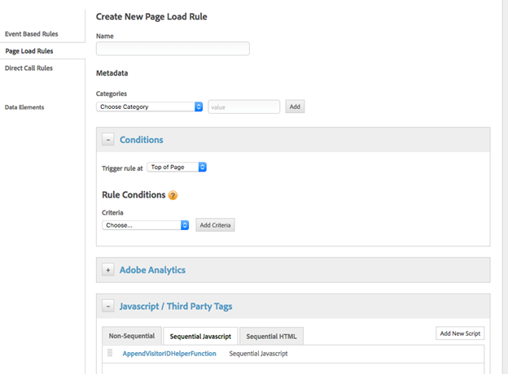

# So legen Sie die Helper-Funktion des Marketing Cloud ID-Diensts in Adobe Dynamic Tag Manager fest


Dies ist eine ausführliche Anleitung zum Festlegen der Hilfsfunktion für den Marketing Cloud-ID-Dienst im Adobe Dynamic Tag Manager.

## Beschreibung {#description}


### <b>Umgebung</b>

Adobe Experience Cloud

### <b>Problem/Symptome</b>

Dieser Artikel erläutert die Implementierung des Adobe Marketing Cloud ID-Diensts. [Funktion zum Anhängen der Besucher-ID](https://experienceleague.adobe.com/docs/id-service/using/id-service-api/methods/appendvisitorid.html?lang=de) in Adobe Dynamic Tag Management (DTM).

<b>Hinweis:</b> Laden Sie den Marketing Cloud-ID-Dienst VisitorAPI.js 1.8.0 oder höher im [DTM-Marketing Cloud-ID-Dienst](https://experienceleague.adobe.com/docs/id-service/using/id-service-api/methods/getmcvid.html) sowohl in der Ursprungs- als auch in der Zieldomäne. Tests sollten in Browsersituationen durchgeführt werden, die Cookies blockieren, um die Funktionalität zu überprüfen.


## Auflösung {#resolution}


### <b>Einrichtung - Domäne A</b>

Legen Sie die Zieldomäne (Domäne B) in einer sequenziellen Seitenladeregel oben mit einem benutzerdefinierten JavaScript von Drittanbietern auf Domäne A fest.

Siehe Screenshots unten als Beispiel:




```clike
//Code on Domain A
var domainB = "www.domainb.com";
 
//Call the ID service
var visitor = Visitor.getInstance ("Insert Marketing Cloud organization ID here",{
trackingServer:"Insert tracking server here here", //Same as s.trackingServer
trackingServerSecure: "Insert secure tracking server here", //Same as s.trackingServerSecure
...
//Other getInstance variables here
...
});
 
//Add the helper function
var domainBWithVisitorIDs = visitor.appendVisitorIDsTo(domainB);
 
//Redirect to Domain B
window.location = _satellite.getVisitorId().appendVisitorIDsTo(domainB)
```


<b>Hinweis:</b> Um zu einem expliziteren Pfad umzuleiten, muss die Domäneneinstellung diese Absicht widerspiegeln. Wenn die Umleitungen eine dynamischere Konstruktion erfordern, kann der benutzerdefinierte Code zu einem Datenelement oder einer Regel für Direktaufrufe hinzugefügt werden. Beispiel: `var domainB = "http://www.domainb.com/products/"`

### <b>Verifizierung - Domäne B</b>

Navigieren Sie von Domäne A zu Domäne B. Stellen Sie sicher, dass die MID in Domäne B mit der MID in Domäne A übereinstimmt, indem Sie Folgendes in der Entwicklerkonsole aufrufen:  `_satellite.getVisitorId().getMarketingCloudVisitorID()().appendVisitorIDsTo(domainB)`
