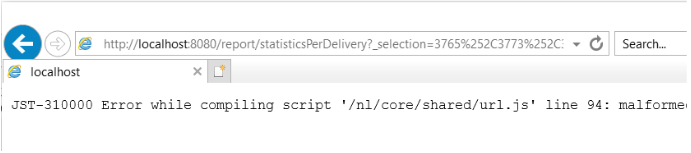

# Versandberichte können aufgrund der IE-Beschränkung keine Statistiken in ACC aggregieren


Dieser Artikel behandelt das Problem, dass Versandberichte aufgrund einer Internet Explorer-Beschränkung der URL-Länge keine Statistiken in Adobe Campaign Classic aggregieren können. Um dieses Problem zu umgehen, kopieren Sie die URL in den Bericht, ändern Sie sie und fügen Sie sie zur -Adresse der Instanz hinzu.

## Beschreibung {#description}


### Umgebung

Campaign Classic

### Problem/Symptome

Das Problem bezieht sich auf die maximale URL-Länge in Internet Explorer, die 2048 Zeichen lang ist:[details](https://support.microsoft.com/en-us/topic/maximum-url-length-is-2-083-characters-in-internet-explorer-174e7c8a-6666-f4e0-6fd6-908b53c12246).

Die HTML-Quelle der Seite zeigt Berichte in der ACC-Clientkonsole an.

Die URLs innerhalb der `href` -Attribute der `<` a`>`  -Tags sind gut, d. h. sie werden nicht abgeschnitten. Wenn jedoch eine URL kopiert und in IE eingefügt wird, wird der Link auf 2048 Zeichen gekürzt und Sie können ihn nicht öffnen:



Dasselbe passiert, wenn Sie mit der rechten Maustaste auf den Bericht in der Clientkonsole klicken und *&quot;In neuem Fenster öffnen&quot;*. Dadurch wird IE automatisch geöffnet, aber die Adressleiste ist leer. Wenn weniger Sendungen ausgewählt und die Schritte wiederholt werden, wird IE mit der richtigen URL geöffnet.

Derzeit wird ständig versucht, IE durch Edge zu ersetzen. Edge basiert auf Chromium und verfügt nicht über diese URL-Beschränkungen. Dies wurde durch Kopieren/Einfügen der langen URL in Edge bestätigt, wodurch die URL nicht abgeschnitten und der Bericht ohne Probleme geöffnet wird:


## Auflösung {#resolution}


Dieses Problem sollte automatisch behoben werden, sobald der Übergang von IE zu Edge abgeschlossen ist. Bis dahin kann die folgende Problemumgehung bereitgestellt werden:

- Kopieren Sie die URL aus der ACC-Clientkonsole in den Bericht, indem Sie mit der rechten Maustaste auf den Bericht klicken und *den Kopierbefehl*. Dadurch sollte die gesamte URL in die Zwischenablage kopiert werden.
- Die URL muss geringfügig geändert werden, damit sie in anderen Browsern geöffnet werden kann. Die kopierte URL folgt diesem Muster:


  ```
  javascript:switchToReportView(%22statisticsPerDelivery%22,%20%22/report/statisticsPerDelivery?_selection=3765%252C37...
  ```


- Der Teil der URL, der von `/report/` muss kopiert und an die Adresse der Instanz angehängt werden. In diesem Fall lautet die Adresse *localhost*:


  ```
  http://localhost:8080/report/statisticsPerDelivery?_selection=3765%252C3773%252C3781%252C3789%252C3793%252C3769%...
  ```


- Kopieren Sie die resultierende URL in einen anderen Browser (Edge, Firefox oder Chrome sollten alle funktionieren).

