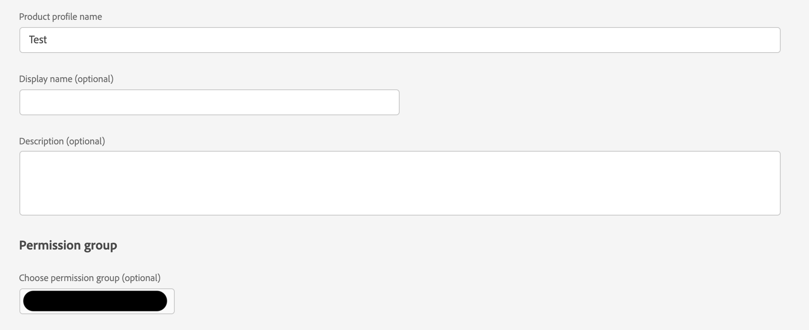

# AAM Option zum Verknüpfen der Anzeigengruppe mit AAM Gruppe wird nicht angezeigt

Erfahren Sie, wie Sie ein Audience Manager-Produktprofil mit einer Berechtigungsgruppe für Audience Manager Role-Based Access Control synchronisieren.

## Beschreibung {#description}

<b>Umgebung</b>

Adobe Audience Manager

<b>Problem/Symptome</b>

Wie synchronisiert man ein Admin Console-Produktprofil mit einer Berechtigungsgruppe für Audience Manager Role-Based Access Control (RBAC)?

## Auflösung {#resolution}

Der Benutzer muss Administratorzugriff auf Audience Manager und Produktadministratorzugriff in der Admin Console haben.

1. Erstellen Sie eine RBAC-Berechtigungsgruppe in Audience Manager. Notieren Sie sich den Namen der ausgewählten Berechtigungsgruppe:

   
2. Navigieren Sie zum Audience Manager in der Admin Console und erstellen Sie ein neues Produktprofil. Wählen Sie dann die im Dropdown-Menü erstellte Berechtigungsgruppe aus:

   
3. Fügen Sie relevante Benutzer zum erstellten Produktprofil hinzu:

   

