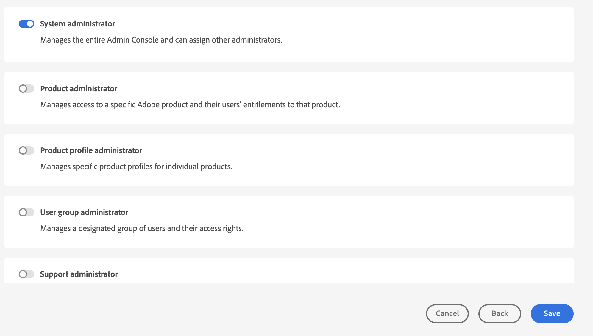
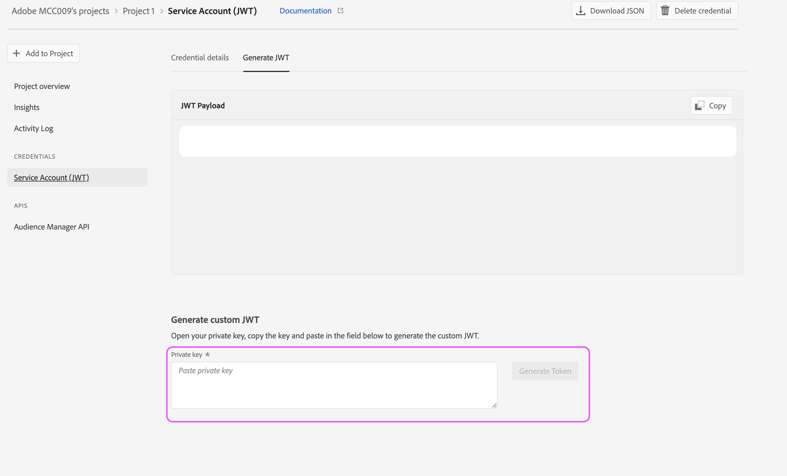
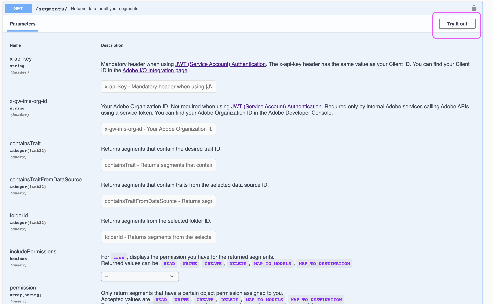

# Einrichten AAM API-Zugriffs

In diesem Artikel wird beschrieben, wie Sie ein Projekt in der Entwicklerkonsole erstellen, um JWT-Anmeldedaten für die Audience Manager-API zu generieren.

## Beschreibung {#description}

### Umgebung

Adobe Audience Manager

### Problem/Symptome

Wie werden Anmeldeinformationen für die Audience Manager-API eingerichtet und generiert?

## Auflösung {#resolution}

Sie benötigen Systemadministratorberechtigungen in der Admin Console, um Anmeldeinformationen für die Audience Manager-API zu generieren. In den Schritten 1 und 2 wird beschrieben, wie Sie diese eskalierten Berechtigungen gewähren. Ihre aktuellen Systemadministratoren können diese Schritte selbst durchführen, anstatt einem zusätzlichen Benutzer eskalierte Administratorberechtigungen zu gewähren. In diesem Fall springen Sie direkt zu Schritt 3.

1. Navigieren Sie zum [Admin Console](https://adminconsole.adobe.com/) und wählen Sie &quot;Admins hinzufügen&quot;aus dem Menü &quot;Quick Links&quot;:     
2. Geben Sie die E-Mails für alle Benutzer ein, denen Sie Zugriff gewähren möchten. Wählen Sie auf der nächsten Seite &quot;Systemadministrator&quot;für die Berechtigungsebene aus:     
3. Navigieren Sie zu [https://developer.adobe.com/console](https://developer.adobe.com/console) . Wenn Sie noch keinen Zugriff haben, obwohl Ihnen in den vorherigen Schritten Systemadministratorberechtigungen gewährt wurden, versuchen Sie, Ihre Cookies/Ihren Cache zu aktualisieren.
4. Erstellen Sie ein neues Projekt über das Schnellstartmenü (oder das Menü &quot;Projekte&quot;in der oberen Navigationsleiste):     
5. Fügen Sie Ihrem Projekt die Audience Manager-API hinzu:     
   
6. Führen Sie die Schritte aus, um Ihre JWT-Anmeldeinformationen zu generieren (oder hochzuladen). Wenn Sie die Anmeldeinformationen über die Entwicklungskonsole generieren möchten, stellen Sie sicher, dass Sie den privaten Schlüssel sicher speichern. Sie benötigen Ihren privaten Schlüssel in späteren Schritten.     
7. Als Nächstes werden Sie aufgefordert, die Anmeldeinformationen relevanten Produktprofilen zuzuweisen. Wenn Ihr Unternehmen rollenbasierte Zugriffskontrollen verwendet, müssen Sie die folgenden Schritte ausführen, um ein technisches Benutzerkonto zu erstellen und dieses Konto der entsprechenden RBAC-Gruppe hinzuzufügen: [https://experienceleague.adobe.com/docs/audience-manager/user-guide/api-and-sdk-code/rest-apis/aam-api-getting-started.html?lang=en#technical-account-rbac-permissions](https://experienceleague.adobe.com/docs/audience-manager/user-guide/api-and-sdk-code/rest-apis/aam-api-getting-started.html?lang=en#technical-account-rbac-permissions)
8. Sobald diese Schritte abgeschlossen sind, können Sie ein Zugriffstoken generieren, um Ihre erste API-Anfrage durchzuführen. Klicken Sie zunächst in der Entwicklungskonsole auf die Übersichtsseite Ihrer Anmeldedaten:     
9. Klicken Sie oben auf der Seite auf die Registerkarte &quot;JWT generieren&quot;, fügen Sie den gesamten privaten Schlüssel aus der in Schritt 6 heruntergeladenen Datei ein und klicken Sie auf &quot;Token generieren&quot;:     

Schließlich können Sie API-Anfragen mithilfe des im vorherigen Schritt abgerufenen Zugriffstokens stellen. Die Aufrufe können von jeder beliebigen API-Plattform, z. B. Postman, direkt über cURL-Befehle oder sogar von unserer API-Dokumentationsseite aus erfolgen: [https://bank.demdex.com/portal/swagger/index.html#/](https://bank.demdex.com/portal/swagger/index.html#/)

Um mithilfe der Demofunktionen in unserer Dokumentation Aufrufe zu tätigen, führen Sie die oben genannten Schritte aus, um Ihr Token zu generieren. Klicken Sie dann rechts auf der Seite auf &quot;Autorisieren&quot;und geben Sie Ihr Token ein:

Stellen Sie außerdem sicher, dass Sie den aam.adobe.io-Server auswählen, wie im Screenshot oben angegeben. Jetzt können Sie die Demofunktion für alle API-Anfragen nutzen, indem Sie die entsprechenden Parameter eingeben und auf die Schaltfläche &quot;Ausprobieren&quot;klicken:

Beachten Sie, dass dadurch eine echte API-Anfrage an Ihre Instanz gesendet wird. Wenn Sie eine DELETE-, PUT- oder POST-Anfrage verwenden, nehmen Sie möglicherweise unbeabsichtigte Änderungen an Ihrer Instanz vor. Achten Sie immer darauf, die Dokumentation für diese API-Aufrufe sorgfältig zu lesen, bevor Sie die Anfrage senden.
