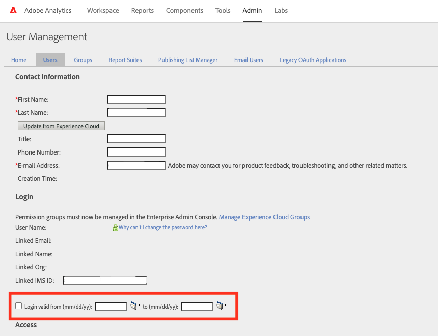

# Zugriff auf Adobe Analytics aufgrund des Fehlers &quot;Analytics-Anmeldung abgelaufen&quot;nicht möglich

In diesem Dokument erfahren Sie, wie Sie auf <b>Adobe Analytics</b> wenn Sie eine Fehlermeldung erhalten - *Analytics-Anmeldung abgelaufen* und muss von einem Produktadministrator erneuert werden.

## Beschreibung {#description}

### <b>Umgebung</b>

Adobe Analytics

### <b>Problem/Symptome</b>

Beim Zugriff auf Adobe Analytics wird folgende Fehlermeldung angezeigt.

Analytics-Anmeldung abgelaufen Die Analytics-Anmeldung ist abgelaufen und muss von einem Produktadministrator erneuert werden.
  

## Auflösung {#resolution}

Dies geschieht, da sich das aktuelle Datum außerhalb des gültigen Datumsbereichs für das Konto befindet. Wenden Sie sich an einen Analytics-Administrator in Ihrem Unternehmen, um den gültigen Datumsbereich der Anmeldung zu erweitern. Die Adobe-Kundenunterstützung ist nicht berechtigt, gültige Anmeldungsdatumsbereiche für Benutzerkonten zu ändern.

1. Als Analytics-Administrator wechseln Sie zu Adobe Analytics `>`  Admin `>`  Analytics-Benutzer und -Assets
2. Wählen Sie die betreffende Benutzer-ID aus.
3. Erweitern Sie im Fenster Benutzerverwaltung den gültigen Datumsbereich &#39;Login valid from (mm/dd/yy):&#39; and &#39;to (mm/dd/yy):&#39;. Oder deaktivieren Sie einfach das Kontrollkästchen.

・Abgelaufene Anmeldungen
[https://experienceleague.adobe.com/docs/analytics/technotes/troubleshoot-login.html?lang=en#expired-logins](https://experienceleague.adobe.com/docs/analytics/technotes/troubleshoot-login.html?lang=en#expired-logins)
