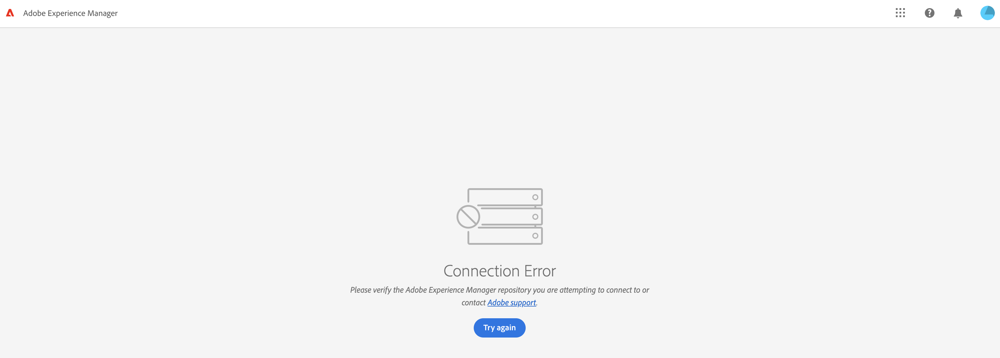

# Adobe Experience Manager: Zugriffsproblem der Inhaltsfragmentkonsole


Erfahren Sie mehr über das Zugriffsproblem der Inhaltsfragmentkonsole , das durch eine benutzerdefinierte CORS-Konfiguration in der Umgebung verursacht wird.

## Beschreibung {#description}


<b>Umgebung</b>

- Adobe Experience Manager


<b>Problem/Symptome</b>

Beim Versuch, von der obersten Ebene der globalen Navigation aus auf die Konsole &quot;Inhaltsfragmente&quot;zuzugreifen, wird ein Fehlerbildschirm angezeigt:

Verbindungsfehler Überprüfen Sie das Adobe Experience Manager-Repository, mit dem Sie eine Verbindung herstellen möchten, oder kontaktieren Sie den Adobe-Support.





## Auflösung {#resolution}


Das Problem kann zwei verschiedene und nicht zusammenhängende Ursachen haben:

Es wurde festgestellt, dass das Problem durch eine benutzerdefinierte CORS-Konfiguration in der Umgebung verursacht werden kann.


```
User configuration:   {   "supportscredentials":true,   "supportedmethods":[    "GET",   "HEAD",   "POST"   ] ,   "maxage:Integer":86400,   "alloworigin":[    "*"   ] ,   "supportedheaders":[    "*"   ] ,   "allowedpaths":[    ".*"   ]    }
```


Nach dem Entfernen der Konfiguration kann auf die Inhaltsfragmentkonsole zugegriffen werden.

Die zweite Ursache für dasselbe Problem war die OSGi-Konfiguration des Day CQ Link Externalizer, der die URL der Inhaltsfragmentkonsole wie unten dargestellt änderte:

- von [https://experience.adobe.com/?repo=author-pxxxxx-eyyyyyy.adobeaemcloud.com#/@user_name/aem/cf/admin/](https://experience.adobe.com/?repo=author-pxxxxx-eyyyyyy.adobeaemcloud.com#/@customer_name/aem/cf/admin/)
- nach [https://experience.adobe.com/?repo=author-environment.com#/@user_name/aem/cf/admin/](https://experience.adobe.com/?repo=author-environment.com#/@customer_name/aem/cf/admin/)


Auf die Inhaltsfragmentkonsole konnte nach der Aktualisierung der Externalizer-Konfiguration auf die richtige Autoren-URL zugegriffen werden.


