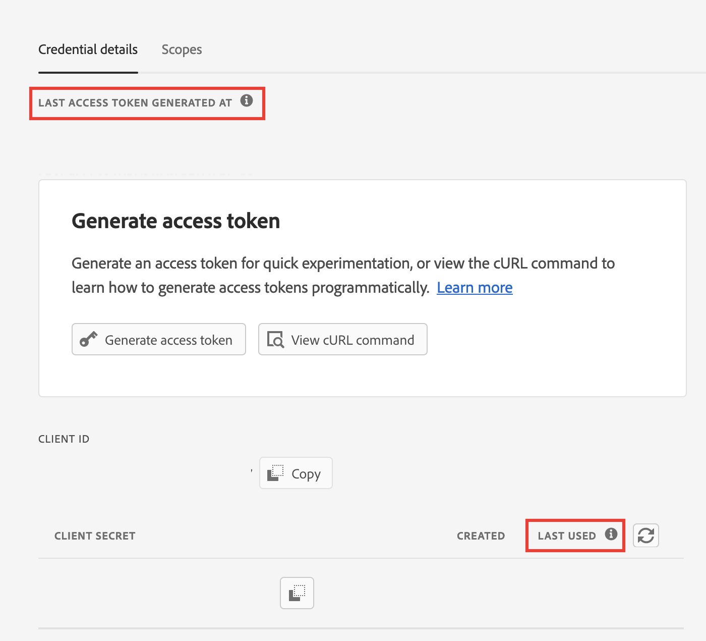

# Schritte zum Migrieren von Anmeldedaten von JWT zu OAuth-Server-zu-Server

Erfahren Sie, wie Sie von Dienstkonto zu OAuth Server-zu-Server-Anmeldedaten migrieren, um die neuen OAuth Server-zu-Server-Anmeldedaten zu verwenden.

## Beschreibung {#description}

### Umgebung

- Analytics
- Audience Manager
- Journey Analytics

### Problem/Symptome

Die Anmeldedaten für Service-Konten (JWT) wurden zugunsten der neuen OAuth-Server-zu-Server-Anmeldedaten eingestellt. Die neue Berechtigung erleichtert Ihnen die Entwicklung und Pflege von Adobe-Applikationen. Außerdem entfällt die Notwendigkeit, Zertifikate regelmäßig zu rotieren, und es funktioniert sofort mit standardmäßigen OAuth2-Bibliotheken. 

<b>Hinweis: Keine Ihrer laufenden Adobe-Anwendungen oder -Integrationen wird bis zum 1. Januar 2025 unterbrochen.</b>
        <b></b>       

## Auflösung {#resolution}

1. Melden Sie sich bei [Adobe Developer-Konsole](https://developer.adobe.com/console).
2. Wählen Sie im Filtermenü auf der linken Seite die Option <b>Hat Service-Konto-Berechtigung (JWT)</b>l. Auf diese Weise werden alle Projekte angezeigt, die über eine JWT-Berechtigung (Service Account) verfügen.

   
3. Klicken Sie auf <b>Hinzufügen neuer Anmeldedaten</b> -Schaltfläche, um die Migration zu starten.

   
4. Die neue Berechtigung <b>OAuth Server-zu-Server</b> wurde auf der linken Seite hinzugefügt. Klicks <b>Migration abbrechen</b> , wenn Sie die Migration abbrechen möchten. Klicken Sie auf <b>Überprüfen und Löschen </b>Schaltfläche nach der Überprüfung, ob die neue Berechtigung <b>OAuth Server-zu-Server</b> funktioniert ordnungsgemäß. Löschen Sie die JWT-Berechtigung, um die Migration abzuschließen.

   
5. Aktualisieren Sie den Code der Benutzeranwendung mit der OAuth2.0-Bibliothek, um das Zugriffstoken mit den neuen Anmeldedaten zu generieren. (Weitere Bibliotheken finden Sie unter [https://oauth.net/code/](https://oauth.net/code/)).

   - [PassportJS](https://github.com/jaredhanson/passport) (Node.js)
   - [Frühlingssicherheit](https://spring.io/projects/spring-security) (Java)
   - [Authlib](https://github.com/lepture/authlib) (Python)
6. Überprüfen Sie den Zeitstempel des zuletzt verwendeten oder des zuletzt verwendeten Menüs, um zu überprüfen, ob die von der Benutzeranwendung generierte Zugriffstoken mit der neuen Berechtigung verwendet wurden.

   
7. Nachdem die alte Berechtigung erfolgreich ersetzt wurde, fahren Sie mit dem letzten Schritt zum Löschen der alten Berechtigung fort.

   
8. Nur die neuen Anmeldedaten für OAuth Server-to-Server bleiben auf der linken Seite, wenn die Migration abgeschlossen ist.

<b>Referenzdokumente</b>
Um sicherzustellen, dass die Anwendung nach dem 1. Januar 2025 weiterhin funktioniert, muss sie migriert werden, um die neuen OAuth Server-zu-Server-Anmeldeinformationen zu verwenden.
Der Migrationsprozess ist einfach und ermöglicht eine Migration ohne Ausfallzeiten. Weitere Informationen finden Sie in unserer Dokumentation .

1. [Migration von JWT-Anmeldedaten (Service Account)](https://nam04.safelinks.protection.outlook.com/?url=https%3A%2F%2Fpostoffice.adobe.com%2Fpo-server%2Flink%2Fredirect%3Ftarget%3DeyJhbGciOiJIUzUxMiJ9.eyJ0ZW1wbGF0ZSI6ImJsZXRoZXJfbm90aWNlX29hdXRoX3NlcnZlcl90b19zZXJ2ZXIiLCJlbWFpbEFkZHJlc3MiOiJndXd1K3NvbmVAYWRvYmV0ZXN0LmNvbSIsInJlcXVlc3RJZCI6IjM0ZjIyNTMwLThjMzEtNDlkNC1iZjEyLThlZGIyY2E0ODdhOCIsImxpbmsiOiJodHRwczovL3d3dy5hZG9iZS5jb20vZ28vZGV2c19zMnNfbWlncmF0aW9uX2d1aWRlIiwibGFiZWwiOiI5IiwibG9jYWxlIjoiZW5fVVMifQ.Pr8LjAW5wq_tEqCQLs4Y2fwJSTW_Z2FH0CIVInolEKvySfPDiF7vl8Hg4S9ne_V6a74oLfCVzc99EE9K4XUoBQ&amp;amp;data=05%7C01%7Cguwu%40adobe.com%7C3b1b2261ea264d45d9df08db4ce8a7de%7Cfa7b1b5a7b34438794aed2c178decee1%7C0%7C0%7C638188334359675040%7CUnknown%7CTWFpbGZsb3d8eyJWIjoiMC4wLjAwMDAiLCJQIjoiV2luMzIiLCJBTiI6Ik1haWwiLCJXVCI6Mn0%3D%7C3000%7C%7C%7C&amp;amp;sdata=dd8x%2FoDHh0QUi3xboxa78uA54JXEaVq5qYkP8zkvymk%3D&amp;amp;reserved=0)
2. [Verwenden der neuen OAuth Server-zu-Server-Anmeldedaten](https://nam04.safelinks.protection.outlook.com/?url=https%3A%2F%2Fpostoffice.adobe.com%2Fpo-server%2Flink%2Fredirect%3Ftarget%3DeyJhbGciOiJIUzUxMiJ9.eyJ0ZW1wbGF0ZSI6ImJsZXRoZXJfbm90aWNlX29hdXRoX3NlcnZlcl90b19zZXJ2ZXIiLCJlbWFpbEFkZHJlc3MiOiJndXd1K3NvbmVAYWRvYmV0ZXN0LmNvbSIsInJlcXVlc3RJZCI6IjM0ZjIyNTMwLThjMzEtNDlkNC1iZjEyLThlZGIyY2E0ODdhOCIsImxpbmsiOiJodHRwczovL3d3dy5hZG9iZS5jb20vZ28vZGV2c19zMnNfY3JlZGVudGlhbF9vdmVydmlldyIsImxhYmVsIjoiMTAiLCJsb2NhbGUiOiJlbl9VUyJ9.c-c4—RAgDvS0l-WI5yIuYBIbzL7OeWXepCCfSzR1AkdVnrTZmWmm7jYmu11JqHZ_UBPANJqYEzEZrtydXY0Y Q&amp;amp;data=05%7C01%7Cguwu%40adobe.com%7C3b1b2261ea264d45d9df08db4ce8a7de%7Cfa7b1b5a7b343879 4aed2c178decee1%7C0%7C0%7C638183334359675040%7CUnknown%7CTWFpbGZsb3d8eyJWIjoiMC4wLW jAwMDAiLCJQIjoiV2luMzIiLCJBTiI6Ik1haWwiLCJXVCI6Mn0%3D%7C3000%7C%7C%7C&amp;amp;sdata=YwiTIXMxPv MhhEhVR3sv0g%2Bqi4NP8OERnJxE9C65I0%3D&amp;amp;reserviert=0)
3. [ Häufig gestellte Fragen (FAQ) ](https://nam04.safelinks.protection.outlook.com/?url=https%3A%2F%2Fpostoffice.adobe.com%2Fpo-server%2Flink%2Fredirect%3Ftarget%3DeyJhbGciOiJIUzUxMiJ9.eyJ0ZW1wbGF0ZSI6ImJsZXRoZXJfbm90aWNlX29hdXRoX3NlcnZlcl90b19zZXJ2ZXIiLCJlbWFpbEFkZHJlc3MiOiJndXd1K3NvbmVAYWRvYmV0ZXN0LmNvbSIsInJlcXVlc3RJZCI6IjM0ZjIyNTMwLThjMzEtNDlkNC1iZjEyLThlZGIyY2E0ODdhOCIsImxpbmsiOiJodHRwczovL3d3dy5hZG9iZS5jb20vZ28vZGV2c19zMnNfbWlncmF0aW9uX2d1aWRlX2ZhcSIsImxhYmVsIjoiMTEiLCJsb2NhbGUiOiJlbl9VUyJ9.8IlQUL_WbLKsMUDG4VHvqnwqI0l6TzEXSN0I_R_dXCswvDQpusEgm5LstaLYWzPy0crhk_ShRbmjZvMVS5t1Mg&amp;amp;data=05%7C01%7Cguwu%40adobe.com%7C3b1b2261ea264d45d9df08db4ce8a7de%7Cfa7b1b5a7b34438794aed2c178decee1%7C0%7C0%7C638188334359675040%7CUnknown%7CTWFpbGZsb3d8eyJWIjoiMC4wLjAwMDAiLCJQIjoiV2luMzIiLCJBTiI6Ik1haWwiLCJXVCI6Mn0%3D%7C3000%7C%7C%7C&amp;amp;sdata=n4WBY0gemPujdOZRaTMICsePuQJsuh9STbkgEsvyai8%3D&amp;amp;reserved=0)

Wenden Sie sich bei Fragen an Ihren Adobe-Support-Mitarbeiter oder besuchen Sie die Adobe Developer Console. [forums](https://nam04.safelinks.protection.outlook.com/?url=https%3A%2F%2Fpostoffice.adobe.com%2Fpo-server%2Flink%2Fredirect%3Ftarget%3DeyJhbGciOiJIUzUxMiJ9.eyJ0ZW1wbGF0ZSI6ImJsZXRoZXJfbm90aWNlX29hdXRoX3NlcnZlcl90b19zZXJ2ZXIiLCJlbWFpbEFkZHJlc3MiOiJndXd1K3NvbmVAYWRvYmV0ZXN0LmNvbSIsInJlcXVlc3RJZCI6IjM0ZjIyNTMwLThjMzEtNDlkNC1iZjEyLThlZGIyY2E0ODdhOCIsImxpbmsiOiJodHRwczovL2V4cGVyaWVuY2VsZWFndWVjb21tdW5pdGllcy5hZG9iZS5jb20vdDUvYWRvYmUtZGV2ZWxvcGVyLWNvbnNvbGUvY3QtcC9hZG9iZS1pby1jb25zb2xlIiwibGFiZWwiOiIxMiIsImxvY2FsZSI6ImVuX1VTIn0.P8FY77-eRzVSjnf09no_Hn5owFmpREoMVLK5OSTU6WWBApUGuQH0fokMAu1R0L-uTQlCovlnIGYD7NRoqMFD8g&amp;amp;data=05%7C01%7Cguwu%40adobe.com%7C3b1b2261ea264d45d9df08db4ce8a7de%7Cfa7b1b5a7b34438794aed2c178decee1%7C0%7C0%7C638188334359675040%7CUnknown%7CTWFpbGZsb3d8eyJWIjoiMC4wLjAwMDAiLCJQIjoiV2luMzIiLCJBTiI6Ik1haWwiLCJXVCI6Mn0%3D%7C3000%7C%7C%7C&amp;amp;sdata=%2FhbICP9PCZsfsNDrBYaGlEb%2FREbBJMjNZeWPzoOPJsk%3D&amp;amp;reserved=0).
