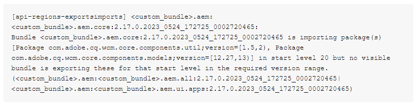

# Pipeline-Fehler beim Erstellen von Bildschritten

Nach dem Aktualisieren des lokalen SDK und dem Ändern der *`<`aem-sdk-api`>`* im *pom.xml-Datei* im Stammverzeichnis des Projekts können Probleme mit der Pipeline auftreten. Die Pipeline schlägt während des Erstellungsbildschritts fehl. Um dieses Problem zu beheben, müssen Sie die *`<`aem-sdk-api`>`* auf eine frühere Version umzustellen.

## Beschreibung {#description}

### <b>Umgebung</b>

Adobe Experience Manager

### <b>Problem/Symptome</b>

Nach dem Aktualisieren des lokalen SDK und Ändern der `<` aem-sdk-api`>`  des `pom.xml` im Stammverzeichnis des Projekts können Probleme mit der Pipeline auftreten.

Während des Erstellungsbildschritts schlägt die Pipeline fehl.

In den Build-Protokollen werden Meldungen ähnlich dem `[` 1`]`  vorhanden sind.

<b>`[` 1`]` </b>

<b></b>

## Auflösung {#resolution}

Gemäß `[` 1`]` , die *`[`api-region-exportsimports`]`* prüft, ob alle OSGI-Bundles ihre Import-Package-Deklarationen durch die Export-Package-Deklaration anderer im Maven-Projekt enthaltener Bundles erfüllen.

Um eine Fehlerbehebung durchzuführen, überprüfen Sie, ob das Paket, das das Paket bereitstellt, in der Bereitstellung enthalten ist. Alternativ können Sie sich das Manifest des Bundles ansehen, das Sie wahrscheinlich exportieren würden, um festzustellen, ob der falsche Name oder die falsche Version verwendet wurde.

Die plausibelste Erklärung dafür könnte jedoch in Ihrem Fall sein, dass Ihre AEM-Instanz noch die etwas veraltete Version ausführt `cq.wcm.core.components` Bundle, das eine ältere Version von `com.adobe.cq.wcm.core.components.util` und `com.adobe.cq.wcm.core.components.models.`

Aber seit der `aem-sdk-api` -Version in der Codebasis auf eine neuere Version aktualisiert wurde, verweist sie auf eine neuere Version dieser Pakete.

Um dieses Problem zu beheben, müssen Sie `aem-sdk-api`auf eine frühere Version umzustellen.

Weitere Informationen finden Sie unter [AEM as a Cloud Service SDK Build Analyzer Maven-Plug-in](https://experienceleague.adobe.com/docs/experience-manager-core-components/using/developing/archetype/build-analyzer-maven-plugin.html?lang=de) im Handbuch AEM Kernkomponenten .
