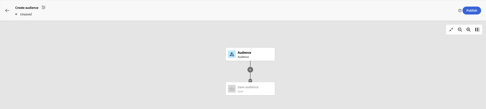

# AEP - Zielgruppe erstellen ist schreibgeschützt - Welche Berechtigungen benötigen wir?

Wenn der Erstellungsprozess beim Zugriff auf die <b>Zielgruppen</b> Abschnitt zum Erstellen einer neuen Zielgruppe zeigt ein schreibgeschütztes Flag an, überprüfen Sie, ob *Profilverwaltung*&quot; -Berechtigungen haben &quot;*Zusammenführungsrichtlinien verwalten*&quot;.

## Beschreibung {#description}

### Umgebung

Adobe Experience Platform

### Problem/Symptome

Beim Zugriff auf den Abschnitt Zielgruppen zum Erstellen einer neuen Zielgruppe zeigt der Erstellungsprozess eine schreibgeschützte Markierung an, wie z. B.:

## Auflösung {#resolution}

Um das schreibgeschützte Flag zu entfernen, stellen Sie sicher, dass der *Profilverwaltung*&quot; -Berechtigungen in AEP enthalten &quot;<b>Zusammenführungsrichtlinien verwalten</b>&quot;. Dies führt zum Verschwinden der Markierung:

