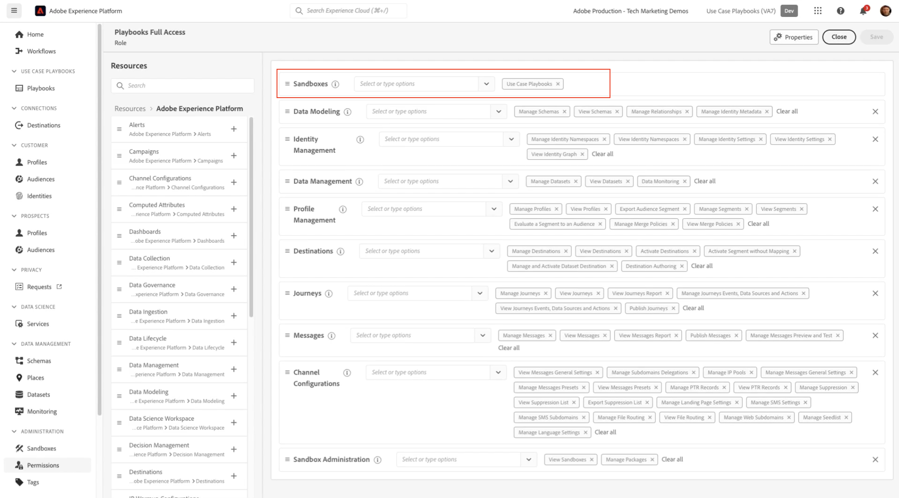

# Adobe Experience Platform-Anwendungsfall-Playbook-Menü fehlt

Wenn die Variable *Anwendungsbeispiele für Playbooks* in Ihrer Adobe Experience Platform-Sandbox fehlt, führen Sie die Schritte in diesem Artikel aus, um darauf zuzugreifen.

## Beschreibung {#description}

### <b>Umgebung</b>

Adobe Experience Platform

### <b>Problem/Symptome</b>

Nachdem Sie den Vorgang in der Dokumentation für Adobe Experience Platform ausgeführt haben *Anwendungsbeispiele für Playbooks*, die *Playbook* im Menü auf der linken Seite nicht sichtbar ist.

## Auflösung {#resolution}

Es gibt 2 Schritte, um dies zu aktivieren.

1. Erstellen einer Sandbox mit Suchbegriffen -<b>ucp</b> enthalten. Etwas wie *myorg-ucp.*
2. Vergewissern Sie sich, dass der Benutzer über Berechtigungen für die *Anwendungsbeispiel* Funktion

Informationen zum Konfigurieren finden Sie unter diesem Link . *Anwendungsbeispiele für Playbooks* hier: [Adobe Experience Platform-Anwendungsfallbücher](https://experienceleague.adobe.com/en/docs/experience-platform/use-case-playbooks/playbooks/get-started)
