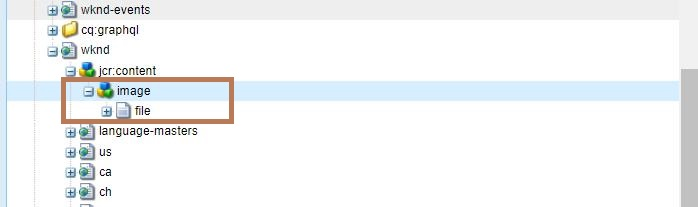

# Adobe Experience Manager: So entfernen Sie die vorhandene Miniaturansicht von einer Seite

In diesem Artikel wird eine Methode eingeführt, mit der die Einstellung für die Miniaturansicht wieder auf die Standardeinstellung zurückgesetzt wird.

## Beschreibung {#description}

### <b>Umgebung</b>

- Adobe Experience Manager as a Cloud Service
- Adobe Experience Manager 6.5

### Problem/Symptome

Es ist zwar möglich, eine auf einer Seite festgelegte Miniaturansicht zu ändern, es gibt jedoch keine direkte Option, um sie auf den Standard zurückzusetzen.

## Auflösung {#resolution}

Um dieses Problem zu beheben, löschen Sie den Knoten /jcr:content/image , der sich unter dem Seitenpfad befindet. Wenn Sie beispielsweise den Knoten /content/wknd/jcr:content/image in CRXDE Lite löschen, wird die Miniaturansicht für die Homepage der WKND-Site auf den Standard zurückgesetzt.

