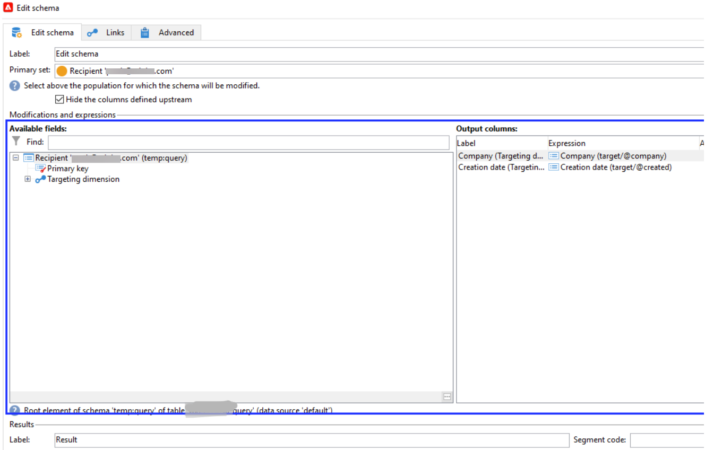
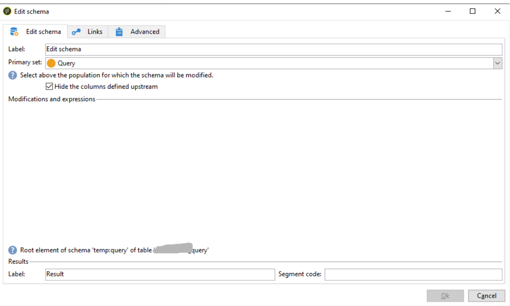

# Abschnitt für Änderungen und Ausdrücke fehlt in der Aktivität Schema bearbeiten

Wenn in Adobe Campaign Classic die Variable *Änderungen und Ausdrücken* -Abschnitt fehlt im *Schema bearbeiten* -Aktivität verwenden, wird empfohlen, die Registry zu löschen und Ihren lokalen Cache zu löschen. Führen Sie die in diesem Artikel genannten Schritte aus, um das Problem zu beheben.

## Beschreibung {#description}

### Umgebung

Adobe Campaign Classic

### Problem/Symptome

Die *Änderung und Ausdrücke* fehlt beim Hinzufügen der Aktivität Schema bearbeiten in einem Workflow.

<b>Zu reproduzierende Schritte</b>:

1. Erstellen Sie einen Workflow (wkf) und fügen Sie einen *Schema bearbeiten*-Aktivität.
2. Öffnen Sie diese Aktivität und wählen Sie eine *Primär* festgelegt ist.
3. Beachten Sie, dass <b>Änderungen und Ausdrücken</b> im Schema &quot;Bearbeiten&quot;fehlt.

Schema bearbeiten mit *Änderungen und Ausdrücken*:

Schema bearbeiten ohne *Änderungen und Ausdrücken*:

## Auflösung {#resolution}

Gehen Sie wie folgt vor, um das Problem zu beheben:

1. Löschen Sie die Registrierung.
   - Um die Registrierung zu öffnen, geben Sie <b>Registrierung</b> in der Suchleiste.
   - Öffnen Sie die <b>Registrierungs-Editor</b>.
   - Suche `Computer\HKEY_CURRENT_USER\SOFTWARE\Neolane`und löschen Sie den gesamten Inhalt aus dem Ordner Neolane .
2. Löschen Sie den lokalen Cache von `C:\Users<user>\AppData\Roaming\Neolane\NL_5`. <b>Hinweis: </b>Löschen Sie nicht die `nlclient_cnx.xml`-Datei.
   - Navigieren Sie je nach Betriebssystemversion zu den folgenden Speicherorten:
      - Windows 7: `C:\Users< Username >\AppData\Roaming\Neolane\NL_5\`
      - Windows XP: `C:\Documents and Settings< Username >\Application Data\Neolane\NL_5`
   - Hier sehen Sie viele XML-Dateien namens `nlclient-config-< alphanumerical value >.xml`. Löschen Sie diese XML-Dateien und die zugehörigen Ordner, aber löschen Sie nicht die `nlclient_cnx.xml` -Datei.

### Verwandte Lesungen

[So führen Sie eine Hard Cache-Löschung durch, wenn die Probleme gerätespezifisch oder benutzerspezifisch sind](https://experienceleague.adobe.com/en/docs/campaign-classic/using/getting-started/starting-with-adobe-campaign/faq/faq-campaign-config#perform-hard-cache-clear)in der Campaign Classic v7-Dokumentation.

